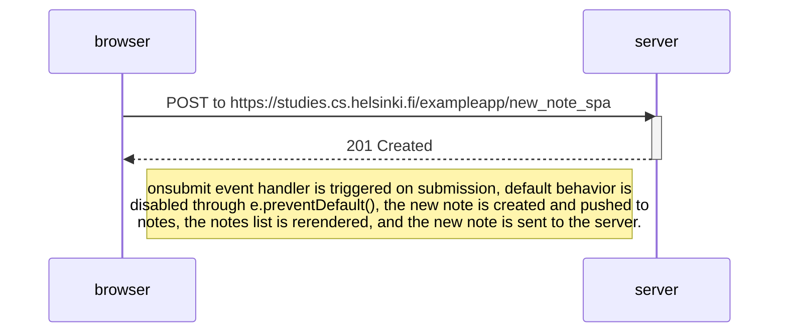

# Sequence Diagram for Opening Single Page App: https://studies.cs.helsinki.fi/exampleapp/spa

```mermaid
sequenceDiagram
    participant browser
    participant server

    browser->>server: POST to https://studies.cs.helsinki.fi/exampleapp/new_note_spa
    activate server
    server-->>browser: 201 Created
    deactivate server

    Note right of browser: onsubmit event handler is triggered on submission, default behavior is <br>disabled through e.preventDefault(), the new note is created and pushed to <br>notes, the notes list is rerendered, and the new note is sent to the server.
```
